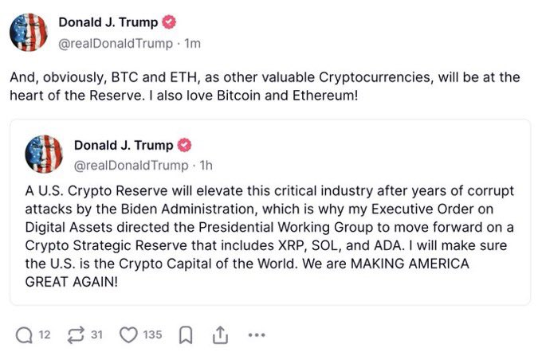

### Politicians Should Not Be Placed on Pedestals
Just to be clear I don't think the below announcement will really change much for the landscape of Bitcoin in the long run. Nation states will need to inevitably adopt Bitcoin and hyperbitcoinization will result. What I do find interesting is that likelihood of grift at the highest levels. This isn't some sort of 4D chess, but I think more likely the result of insiders and political donors coming out on top. Pump the bags on Sunday when traditional markets are closed. 

Gotta love that he was later forced to mention BTC and ETH. 
### Will the US Shitcoin Reserve Have Bitcoin?
Yes, I would even be willing to bet that when the Crypto Reserve is created it will be a majority Bitcoin. After all that's what the majority of the DOJ currently has on hand anyway with Ethereum being second. The current ~69,730 coins would likely be converted by Executive Order to be the initial seed of the reserve. 

### What next?
Who knows. Honestly this is stuff that Bitcoiners have been talking about for a while now but this timeline is unreal. The matter of when and how is unknown to us plebs. 

